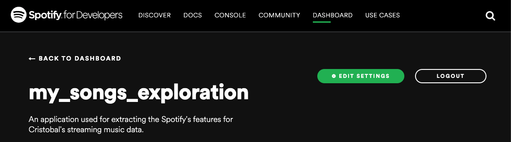

# Extraction of Spotify Streaming History



This a Python project that uses your personal streaming history data and extracts the Spotify's features to each one of your songs. This only applies to songs. 

If you want to learn more about the Spotify features, you can take a look at my [Part 2 Spotify Project](https://github.com/cristobalza/spotify_my_songs_classifier), where I start exploring the data that I obtained from here, or you can take a look at the offical documentation [here](https://developer.spotify.com/documentation/web-api/reference/tracks/get-audio-features/)

## Getting Started

Follow the following instructions to use this project on your own streaming history and machine.

### Prerequisites

- A Spotify account.

- Have some understanding on how to use your local Terminal.

- Software you need to get installed in your machine:

```
Python            3.7.5
astroid           2.4.2
certifi           2020.6.20
chardet           3.0.4
gunicorn          20.0.4
idna              2.10
isort             4.3.21
lazy-object-proxy 1.4.3
mccabe            0.6.1
numpy             1.19.1
pandas            1.1.0
pip               20.2.1
pylint            2.5.3
python-dateutil   2.8.1
pytz              2020.1
requests          2.24.0
rope              0.17.0
setuptools        49.2.1
six               1.15.0
spotipy           2.13.0
toml              0.10.1
typed-ast         1.4.1
urllib3           1.25.10
wheel             0.34.2
wrapt             1.12.1
```

However, in your project directory you can `pip3 install virtualenv` to install or check if you have installed in your machine `virtualenv`, a Python virtual enviroment. Then run `pip install -r requirements.txt`, which you can take a look at the file before running the command to see what your would "pip install".

### How to Use

1. Ask Spotify for your own personal data by going to [this website](https://www.spotify.com/uk/account/privacy/) and sign in with your Spotify account. Then scroll down to the bottom and ask for Request.
2. You might have to wait for a few days until you will receive an email from Spotify with the email prompt *"Your Spotify personal data is ready to download"*. Open the email and download the ZIP file.
4. Now in your machine, create a project directory and put all the files of this repository into your project directory. Then proceed to replace my files with yours.
5. Create a new Python enviroment and then run `pip install -r requirements.txt`. The command will download all the required packages that I used in this project for you. You can take a look at what your computer will download if you open the `requirements.txt` file. Remember to run the command in your project directory and not outside or inside some other directory.
6. Now that you are set with the packages and the data ready to get the features extracted, you need to create a Spotify App. Go to [this website](https://developer.spotify.com/dashboard/login) and login using your Spotify account.
7. Once you access, you need to create an app. Name the app and give a description. From this app you need the `client_id` and the `client_secret`. 
3. The ZIP file will contain various files. For this project you are only interest on the files that have the following name `StreamingHistory[SOME NUMBER].json`. You will need all of them. Each of this files are composed at most by 10000 streamings records. In other words, it is expected to have various JSON files with the `StreamingHistory` name
8. Copy and paste those two keys into `src/your_data.py`. Add your Spotify username to the `username` String variable.
9. Finally, open your Terminal and go to your project directory and run `python -u "src/main.py"`. This will execute the code in the `main.py` file, which you can see the detailed steps that the algortihm takes to extract the features of your streaming history songs.

## Deployment

You can use this data for different purposes such as data exploration analysis (EDA), Principal Component Analysis (PCA), or other Machine Learning Algorithms such as Logistic Regression or XGBoost algorithms to see the different algorithm performances using your own data. You can take a look at  my [Part 2 Spotify Project](https://github.com/cristobalza/spotify_my_songs_classifier) to see how I deployed my extracted data using Machine Learning Supervised and Unsupervised algorithms to explore and create a classifier.


## Acknowledgments

* My code was inspired by [this code](https://github.com/vlad-ds/spoty-records). You can take a look a Vlad Gheorghe's article that I first found when I was trying to understand the Spotify API [here](https://towardsdatascience.com/get-your-spotify-streaming-history-with-python-d5a208bbcbd3). I first learned about the Spotify API through this article so I recommend to read it as educational tool for using the API.
My code uses the same packages as the code mentioned, but the code above 

* I used [this video tutorial](https://www.youtube.com/watch?v=xdq6Gz33khQ&t=4375s) to learn how to use the Spotify API. This tutorial gave me a better understanding on how the Spotify API cycle works using Python. 

* Use this template to write [this documentation](https://gist.github.com/PurpleBooth/109311bb0361f32d87a2) 